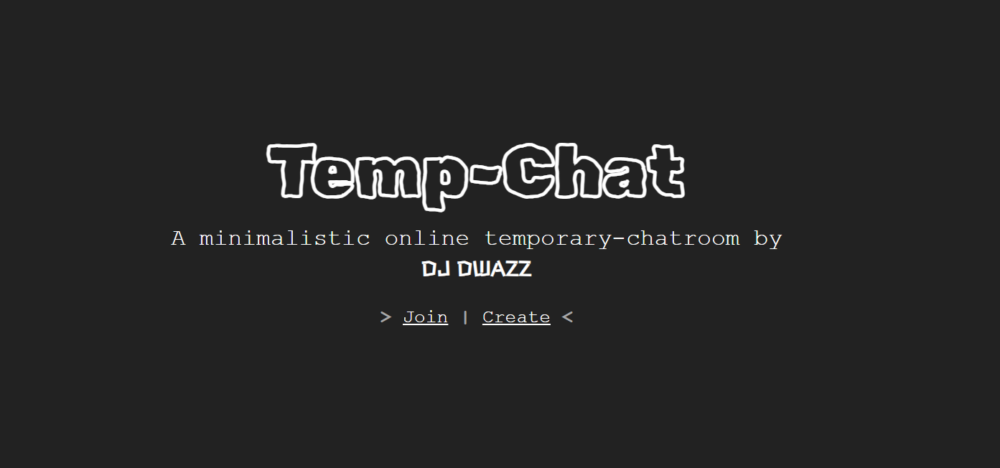

 

## <b>Top Features</b>
> * Minimalistic UI/UX
> * Temporary Service, which make your chats temporary and is erased in realtime
> * Responsive on all devices
> * Scripts can be written through console for making app more beautiful
> * Chat Customization
> * Stores none of your data on server
> * Simple to use !!

 

#### <b>Developer/Maintainer:
↪ [Dwijottam Dutta](https://dwijottam-dutta.github.io)

  
